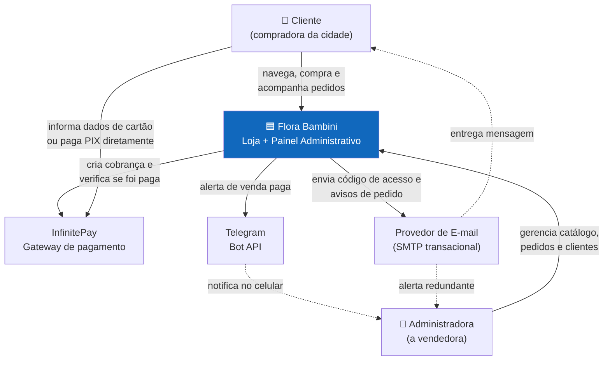
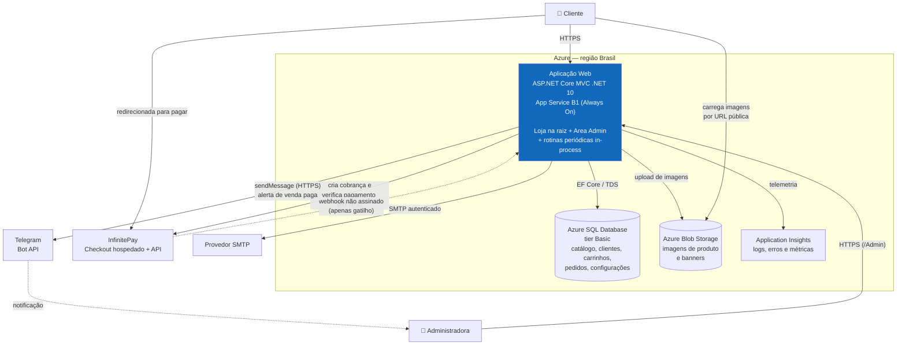
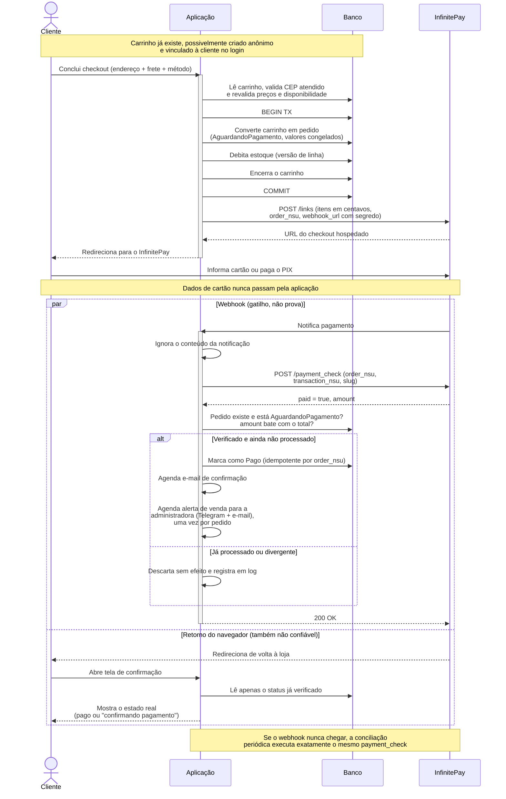
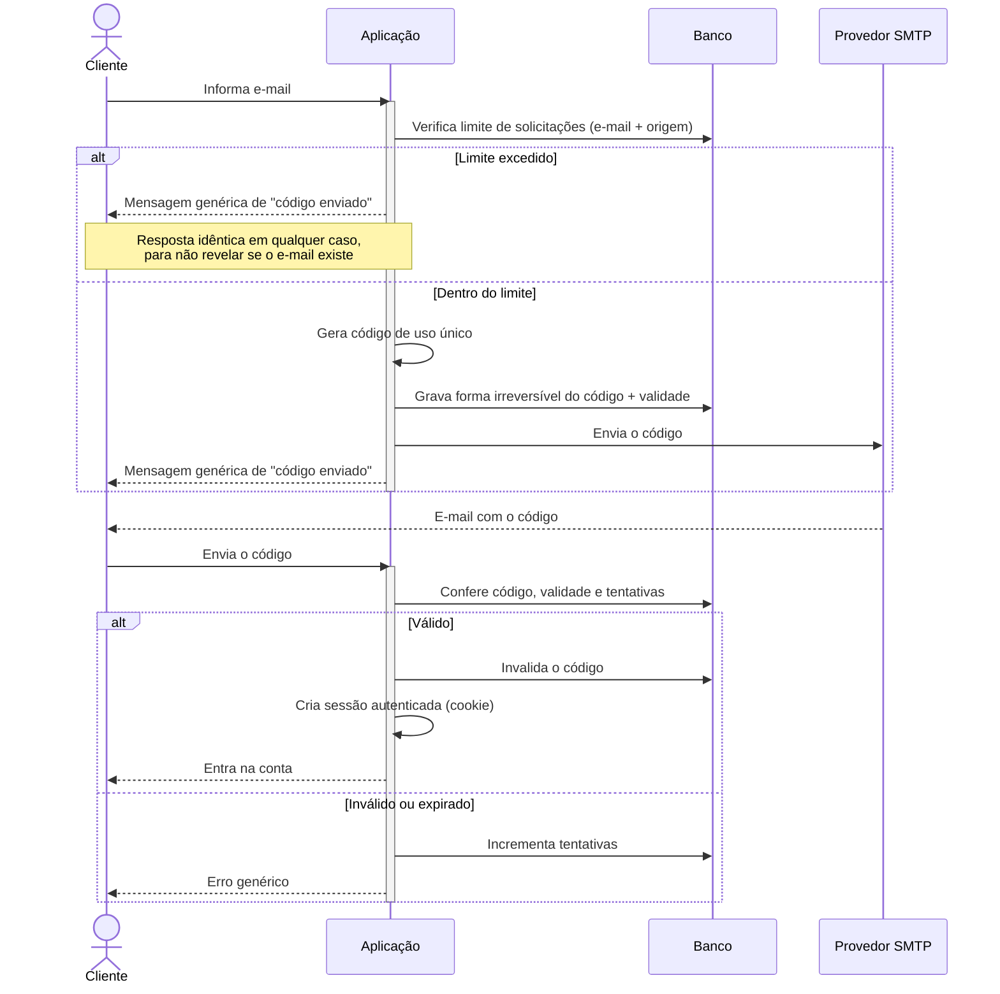
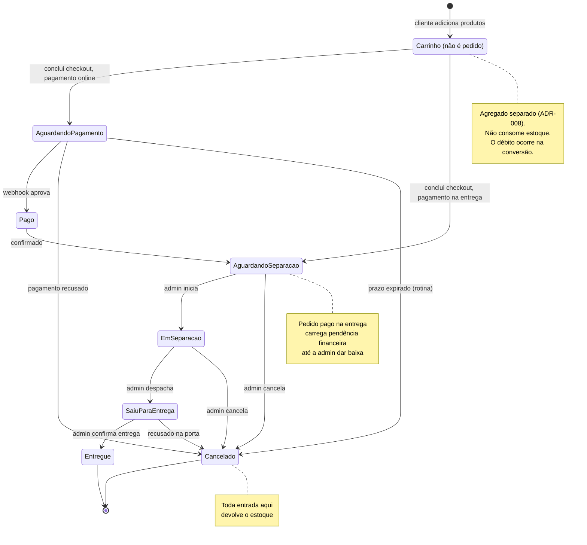

# Proposta Arquitetural — Flora Bambini (e-commerce local)

> Cliente: interno (projeto pessoal — Michel Banagouro) · Documento gerado em 2026-09-16 · Versão 0.5
>
> **Histórico**
> - v0.5 — navegação por categorias hierárquicas (ADR-010): árvore auto-relacionada de profundidade livre, em que `Flora` e `Bambini` são as categorias raiz; produto em uma única categoria; marca como entidade própria e filtro, fora da hierarquia.
> - v0.4 — alerta de venda para a administradora quando o pedido é pago (ADR-009). O pedido original era notificação no WhatsApp pessoal; o canal virou **Telegram (principal) + e-mail (redundante)** por custo e termos de uso, o que mantém intacto o não-objetivo de integração com WhatsApp Business API (§2.3).
> - v0.3 — gateway alterado de PagBank para **InfinitePay**; ADR-003 reescrito: como o webhook do InfinitePay não é assinado, ele passa a ser tratado como gatilho e a confirmação vem de consulta ativa ao gateway. CPF removido do cadastro (o InfinitePay não o exige e não há NF-e); telefone celular incluído por finalidade de entrega.
> - v0.2 — carrinho promovido a agregado próprio, anônimo e persistido (ADR-008); ADR-007 reescrito para converter carrinho em pedido apenas na conclusão do checkout; gênero e data de nascimento removidos do cadastro por minimização de dados (LGPD).

## 1. Sumário executivo

Vamos construir uma loja online própria para substituir o processo atual de venda por WhatsApp (catálogo em Excel, escolha por mensagem, link de pagamento manual, entrega combinada no chat). A loja atende uma única cidade, com entrega própria em raio curto, catálogo de menos de 100 produtos naturais para mães e bebês mais uma linha de limpeza.

**A frase que justifica toda a arquitetura**: é um sistema de baixíssimo volume operado por uma pessoa e mantido por um desenvolvedor só — portanto, cada componente de infraestrutura adicional custa mais do que entrega. A escolha é um **monolito ASP.NET Core MVC único**, com a loja na raiz e o painel administrativo numa `Area`, apoiado em apenas três recursos de nuvem: aplicação, banco relacional e armazenamento de imagens. Nenhuma fila, nenhum cache distribuído, nenhum serviço separado.

As decisões de maior consequência são quatro, e todas trocam flexibilidade por redução de risco:

1. **O sistema nunca vê dados de cartão, e nunca acredita no que lhe contam sobre o pagamento.** A cobrança é criada no InfinitePay e a cliente é redirecionada ao checkout hospedado por eles — o que mantém o projeto no menor escopo possível de conformidade PCI (SAQ-A). Como o webhook do InfinitePay **não é assinado**, nenhuma notificação recebida é tratada como prova: ela apenas dispara uma **consulta ativa ao gateway**, e só a resposta dessa consulta muda o estado do pedido. Sem isso, qualquer pessoa que descobrisse a URL do webhook conseguiria marcar pedidos como pagos.
2. **Login do cliente sem senha.** Autenticação por código de uso único enviado por e-mail. Remove armazenamento de senha, mas transfere a criticidade para a entrega do e-mail — se o e-mail não chega, o cliente não entra. Esse é o maior risco operacional do projeto e está tratado na seção 10.
3. **Frete por faixa de CEP, isolado atrás de uma abstração.** O MVP não depende de nenhuma API de geolocalização. A troca futura para cálculo por raio em quilômetros é uma implementação nova da mesma interface, sem tocar no checkout.
4. **Carrinho e pedido são coisas separadas.** A cliente monta o carrinho sem se identificar; o pedido só nasce na conclusão do checkout, quando o carrinho é convertido. Isso permite comprar antes de criar conta e mantém o estoque livre durante toda a navegação — só o intervalo curto entre concluir o checkout e confirmar o pagamento segura produto.

**Restrições declaradas** (detalhadas na seção 4): plataforma ASP.NET Core MVC .NET 10, hospedagem Azure App Service com Azure SQL, teto de custo mensal de infraestrutura de aproximadamente R$ 100, envio de e-mail por SMTP, aviso imediato de venda paga no celular da administradora, e desenvolvimento por uma única pessoa apoiada por agente de IA.

Esta proposta não estima esforço, custo de desenvolvimento nem cronograma — ver seção 12.

---

## 2. Contexto e objetivos de negócio

### 2.1 Problema

A operação atual é inteiramente manual e roda dentro do WhatsApp. A cliente pede o catálogo; recebe uma planilha Excel; responde com a lista do que quer; a vendedora soma os valores à mão, gera um link de pagamento avulso e combina a entrega. Cada venda consome atenção humana do início ao fim.

As dores concretas desse processo:

- **A vendedora é o gargalo.** Nenhuma venda avança sem ela respondendo. Fora do horário em que está disponível, a demanda simplesmente espera ou se perde.
- **Erro de digitação vira prejuízo.** Preço, soma do pedido e frete são calculados manualmente a cada venda.
- **Não existe estoque confiável.** Produtos são oferecidos sem saber se há unidade disponível, o que gera cancelamento depois do pagamento.
- **Não existe histórico.** Não há registro consultável do que cada cliente comprou, quando, nem por qual valor.
- **O catálogo em Excel não vende.** Uma planilha não mostra foto em tamanho decente, não descreve o produto e não cria vontade de comprar.

Não resolver isso significa que o negócio continua limitado pelo número de conversas que uma pessoa consegue manter por dia.

### 2.2 Objetivos de negócio

- Permitir que a cliente conclua uma compra do início ao fim sem intervenção humana: escolher, pagar e agendar entrega sozinha.
- Eliminar o cálculo manual de total e frete, e com ele o erro de conta.
- Ter estoque e catálogo em um único lugar, mantido pela própria vendedora, sem depender de desenvolvedor para trocar preço, foto ou produto.
- Registrar todo pedido e todo cliente de forma consultável, criando a base de dados que hoje não existe.
- Apresentar o produto com foto e descrição adequadas, elevando o valor percebido em relação a uma linha de planilha.

### 2.3 Não-objetivos

Explicitamente **fora** do escopo, para que nenhuma decisão arquitetural seja tomada para atendê-los:

- **Venda para fora da cidade.** Sem integração com Correios, transportadora ou cálculo de frete nacional. O sistema deve inclusive **recusar** CEPs fora da área atendida.
- **Emissão de nota fiscal.** Sem NF-e/NFC-e, sem certificado digital, sem campos fiscais (NCM, CFOP, CST) no cadastro de produto. Se um dia entrar, entra como módulo novo.
- **Busca textual no catálogo.** Com menos de 100 produtos, a navegação por categoria resolve. Sem índice de busca, sem Elasticsearch, sem `FULLTEXT`. A contrapartida é que a hierarquia passa a ser o **único** caminho da cliente até o produto — o que transfere para o desenho das categorias (ADR-010) o peso que uma busca aliviaria.
- **Aplicativo móvel.** Site responsivo apenas.
- **Multi-loja / multi-tenant.** Uma loja, um dono.
- **Marketplace ou vendedores terceiros.**
- **Integração com ERP, marketplace ou WhatsApp Business API.** O WhatsApp continua existindo como canal humano paralelo, mas fora do sistema. O aviso automático de venda para a administradora sai por Telegram e e-mail, justamente para não trazer a API do WhatsApp para dentro do escopo (ADR-009).
- **Alta disponibilidade.** Indisponibilidade de minutos é tolerável e não gera prejuízo mensurável nesse volume.

### 2.4 Usuários e cargas esperadas

| Perfil | Quantidade | Padrão de uso |
|---|---|---|
| Clientes compradoras | Dezenas a poucas centenas no primeiro ano | Navegação esporádica, concentrada em horário comercial e início da noite |
| Pedidos | Até ~50 por mês | Distribuídos, sem picos sazonais relevantes conhecidos |
| Administradora (a vendedora) | 1 usuária | Uso diário curto: conferir pedidos, mudar status, ajustar estoque |
| Catálogo | Menos de 100 SKUs | Muda pouco: alguns produtos por mês |

A carga é de duas ordens de grandeza abaixo do que qualquer instância mínima de aplicação web aguenta. **Escalabilidade não é um problema deste projeto** e não deve dirigir nenhuma decisão.

---

## 3. Atributos de qualidade prioritários

Quatro atributos dirigem as decisões. Os demais (escalabilidade, disponibilidade) são atendidos com folga pelo padrão da plataforma e não recebem investimento arquitetural.

### 3.1 Simplicidade operacional / manutenibilidade

- **Meta concreta**: a infraestrutura de produção cabe em três recursos do Azure (App Service, SQL Database, Storage Account). Publicar uma alteração é um `git push` que dispara um pipeline. Subir o projeto do zero na máquina de um desenvolvedor exige apenas a connection string e as chaves do gateway.
- **Por quê é prioritário**: o time é **uma pessoa**, que não é dedicada a esse projeto em tempo integral. Todo componente de infraestrutura adicional é custo permanente de atenção — configurar, monitorar, atualizar, depurar quando quebra às 22h. O objetivo de "eliminar o gargalo humano" fracassa se o sistema criar um gargalo humano novo, agora técnico.
- **Como a arquitetura atende**: monolito único, sem mensageria, sem cache distribuído, sem serviço auxiliar. Processamento assíncrono roda no próprio processo da aplicação (ADR-006).

### 3.2 Segurança e privacidade

- **Meta concreta**: nenhum dado de cartão trafega ou é persistido pelo sistema (conformidade PCI DSS no nível SAQ-A). Nenhuma senha de cliente é armazenada. Nenhuma confirmação de pagamento é aceita sem verificação na origem. O cadastro coleta **apenas o que tem finalidade operacional**: nome, e-mail, celular e endereço de entrega (§4). Esses dados são acessíveis somente pela administradora autenticada e trafegam exclusivamente sobre HTTPS.
- **Por quê é prioritário**: o sistema guarda celular e endereço residencial de mulheres e mães — dado pessoal sob LGPD, com o agravante de identificar onde a pessoa mora e como falar com ela. Um vazamento aqui não é incidente técnico, é dano a pessoas reais e responsabilidade legal do titular do negócio. Como não há equipe de segurança, a única defesa viável é **não ter o dado** e **não escrever criptografia própria**. Foi esse critério que tirou gênero e data de nascimento do cadastro, e depois o próprio CPF: nenhum tinha uso operacional, e dado que não se coleta não vaza.
- **Como a arquitetura atende**: checkout redirecionado ao gateway (ADR-003); autenticação delegada ao ASP.NET Core Identity, sem implementação própria de hash, sessão ou token (ADR-004); minimização de dados coletados (seção 10).

### 3.3 Confiabilidade do fluxo pagamento → pedido

- **Meta concreta**: zero pagamentos confirmados sem pedido correspondente registrado, e zero pedidos duplicados por reentrega de webhook. O sistema deve convergir para o estado correto mesmo que o cliente feche o navegador logo após pagar, ou que o gateway entregue a mesma notificação cinco vezes.
- **Por quê é prioritário**: é o único ponto do sistema onde uma falha causa **prejuízo financeiro direto e perda de confiança** — dinheiro recebido sem pedido registrado significa cliente que pagou e não recebe, descoberto só pela reclamação. Todo o resto do sistema é recuperável manualmente; isso não é.
- **Como a arquitetura atende**: o webhook é a fonte de verdade do pagamento, não o retorno do navegador; processamento idempotente com registro do identificador do evento; conciliação ativa por consulta ao gateway para pedidos parados (ADR-003).

### 3.4 Autonomia da administradora sobre o conteúdo

- **Meta concreta**: preço, estoque, foto, descrição, produtos da home, banners e faixas de frete são todos editáveis pelo painel, sem deploy e sem desenvolvedor.
- **Por quê é prioritário**: se cada mudança de preço exigir um desenvolvedor, o sistema não substitui a planilha — ela volta a ser a fonte de verdade e o projeto falha no seu objetivo central.
- **Como a arquitetura atende**: curadoria da home modelada como dado, não como código (ADR-001); regras de frete como configuração em banco (ADR-005).

---

## 4. Restrições

Tudo abaixo é **dado de entrada**, não escolha arquitetural. Onde a restrição tem consequência relevante, ela está anotada.

| Categoria | Restrição | Origem | Consequência |
|---|---|---|---|
| Stack | ASP.NET Core MVC, .NET 10 | Declarada pelo usuário | — (coincide com a escolha que seria feita) |
| Estrutura | Loja na raiz e painel admin em `Area` do **mesmo** projeto | Declarada pelo usuário | Impede separar admin em aplicação própria; exige isolamento por autorização, não por deploy |
| Infra | Azure App Service + Azure SQL Database | Declarada pelo usuário | Descarta alternativas de menor custo por recurso (VPS, containers em plataformas de menor preço) |
| Custo | Teto de aproximadamente **R$ 100/mês** de infraestrutura | Declarada pelo usuário | **Restrição mais apertada do projeto.** Elimina slot de staging, redundância de instância e tiers de banco com folga. Ver ADR-002 |
| Pagamento | Nenhum dado de cartão pode chegar ao backend | Declarada pelo usuário | Obriga checkout hospedado ou tokenização no navegador |
| Pagamento | Conta **InfinitePay** já em uso pela vendedora | Situação atual do negócio | Gateway definido por continuidade operacional e financeira, não por avaliação técnica comparativa. Traz limitações reais — webhook sem assinatura e sem sandbox (ADR-003) |
| E-mail | Envio via **SMTP** (Mailgun/SendGrid citados) | Declarada pelo usuário | Descarta APIs HTTP proprietárias de provedor; favorece portabilidade |
| Autenticação | Cliente entra por código enviado ao e-mail, sem senha | Declarada pelo usuário | Torna a entregabilidade de e-mail um requisito crítico, não acessório |
| Escopo geográfico | Venda restrita à cidade, entrega em até 40 km | Regra do negócio | Sistema deve **bloquear** CEP fora da área |
| Escopo fiscal | Sem emissão de nota fiscal | Decisão do usuário | Sem campos fiscais no domínio |
| Privacidade | Cadastro coleta **apenas nome completo, e-mail e celular**, mais o endereço de entrega. **Não** são coletados gênero, data de nascimento nem CPF | Decisão do usuário — minimização de dados (LGPD) | Celular tem finalidade clara: a entrega é feita pela própria vendedora e ela precisa falar com a cliente na porta. CPF saiu porque o InfinitePay não o exige e não há emissão de nota fiscal |
| Carrinho | Carrinho pode existir sem cliente identificado, e é convertido em pedido apenas na conclusão do checkout | Decisão do usuário | Carrinho é agregado próprio, não rascunho de pedido (ADR-008) |
| Catálogo | Navegação por categorias hierárquicas (`Flora > Cabelo`, `Bambini > Pele`), com cada produto em **uma única** categoria e identificação da **marca** do fabricante | Decisão do usuário | Como não há busca textual (§2.3), a hierarquia é o único caminho até o produto. Modelagem e efeito sobre URL tratados no ADR-010 |
| Notificação | A administradora deve ser avisada no celular assim que um pedido for pago, sem depender de abrir o painel | Decisão do usuário | O pedido original era mensagem no WhatsApp pessoal dela. O canal foi trocado por Telegram + e-mail depois de avaliar custo e termos de uso (ADR-009) — o requisito de negócio é o aviso imediato, não o aplicativo |
| Time | 1 desenvolvedor, não dedicado, apoiado por agente de IA | Situação real | Favorece convenções padrão e amplamente documentadas sobre soluções idiomáticas de nicho |

---

## 5. Decisões arquiteturais (ADRs)

### ADR-001: Monolito único com renderização no servidor, loja na raiz e admin em `Area`

- **Contexto**: sistema de baixíssimo volume (§2.4), mantido por uma pessoa (§4), com prioridade em simplicidade operacional (§3.1). A estrutura de projeto único com `Area` para o admin foi declarada como restrição.
- **Decisão**: uma única aplicação ASP.NET Core MVC, deployada como uma unidade. Views em Razor renderizadas no servidor, sem SPA e sem API pública separada. JavaScript apenas para interações pontuais (quantidade no carrinho, máscara de celular e CEP, upload de imagem no admin). Organização interna por **módulo de negócio** (`Catalogo`, `Clientes`, `Pedidos`, `Entrega`, `Pagamento`, `Conteudo`), cada um com seus controllers, views, serviços e entidades — não por tipo técnico (`Controllers/`, `Services/`, `Models/`) nem em projetos separados por camada.
- **Justificativa**:
  - Um único artefato para publicar, uma única configuração, um único lugar onde ler log. É a diferença entre depurar em minutos e depurar em uma noite (§3.1).
  - Renderização no servidor entrega páginas indexáveis por buscadores sem nenhum trabalho extra. Para uma loja nova, aparecer no Google é aquisição de cliente; uma SPA exigiria renderização server-side configurada à mão para o mesmo resultado.
  - Razor + MVC é o caminho mais documentado da plataforma. Com um desenvolvedor apoiado por IA, usar o caminho mais trilhado reduz erro e acelera geração de código correto (§4, restrição de time).
  - Projetos separados por camada (`Domain`, `Application`, `Infrastructure`, `Web`) custam cerimônia real — referências, mapeamentos, indireção — cujo benefício é substituir infraestrutura sem tocar no domínio. Nada aqui será substituído: não há segundo banco, não há segunda interface, não há segundo time.
  - Módulos por negócio mantêm junto o que muda junto. Mexer em "produto" abre uma pasta, não seis.
- **Alternativas consideradas**:
  - **SPA (React/Blazor) + API** — descartada: duplica o modelo e a validação, prejudica SEO por padrão e dobra a superfície de manutenção sem entregar nada que uma loja de 100 produtos precise.
  - **Clean Architecture em múltiplos projetos** — descartada: o custo de cerimônia é pago hoje para comprar uma flexibilidade que os não-objetivos (§2.3) garantem que não será exercida.
  - **Admin como aplicação separada** — descartada por restrição explícita; ainda que permitida, dobraria o custo de hospedagem contra um teto já apertado.
- **Consequências**:
  - Positivas: menor número de partes móveis possível; transação de banco abrange a operação inteira sem coordenação distribuída; SEO nativo; onboarding trivial.
  - Negativas / dívidas plantadas: sem fronteira imposta pelo compilador, nada impede o módulo de Pedidos acessar diretamente as entidades de Catálogo. A disciplina é convencional, não estrutural. Se o projeto crescer muito, promover os módulos a projetos separados é refatoração de porte médio. **Loja e admin compartilham processo**: um erro não tratado no admin derruba a loja, e ambos escalam juntos.

### ADR-002: Azure SQL Database (tier Basic) + EF Core Code First, com mídia em Azure Blob Storage

- **Contexto**: banco relacional gerenciado no Azure é restrição (§4). O teto de custo (§4) é a variável apertada: App Service e SQL Database precisam caber juntos abaixo dele, junto com o armazenamento das imagens do catálogo.
- **Decisão**: **Azure SQL Database no tier Basic** (tamanho fixo, sem auto-pause). **Azure App Service no tier Basic B1 com Always On habilitado**, Linux. **Azure Blob Storage** (redundância local) para imagens de produto e banners, servidas por URL pública direta. Acesso a dados via **EF Core 10 com migrations Code First**, sem repositórios genéricos sobre o `DbContext`.
- **Justificativa**:
  - **Por que Basic e não o tier gratuito/Serverless**: a oferta gratuita de Azure SQL é *serverless* e depende de auto-pause para caber na cota mensal de vCore-segundos. Banco pausado significa que a **primeira visita depois de um período ocioso espera a retomada da instância** — dezenas de segundos de tela branca. Numa loja que recebe visitas esparsas ao longo do dia, esse é exatamente o padrão de acesso mais penalizado: quase toda visitante seria a primeira. Trocar disponibilidade percebida da vitrine por economia marginal é mau negócio. O tier Basic tem preço fixo, não pausa, e seu limite de armazenamento é muito superior ao que um catálogo de 100 produtos com histórico de pedidos vai ocupar.
  - **Por que B1 e não os tiers Free/Shared do App Service**: os tiers gratuitos não permitem vincular certificado TLS a domínio próprio, e não oferecem Always On — a aplicação hiberna e a primeira requisição paga a inicialização. Uma loja sem HTTPS no próprio domínio não é viável: o navegador marca como não segura e nenhum gateway de pagamento sério opera assim. **B1 é o piso funcional real**, não uma escolha de conforto.
  - **Por que Blob e não o disco do App Service**: separa conteúdo de aplicação, sobrevive a redeploy e reinício sem cuidado especial, custa uma fração irrelevante nesse volume e abre caminho para CDN depois sem mudar nada no código da loja.
  - **Por que EF Core sem repositório genérico**: o `DbContext` já é Unit of Work e o `DbSet` já é repositório. Envolvê-los numa camada própria adiciona indireção e remove capacidade de consulta, em troca de uma portabilidade que não será exercida (§2.3).
  - **Por que Code First**: o esquema evolui junto com o código, versionado no mesmo commit, e a publicação aplica migrations. Com um desenvolvedor só, o banco nunca fica fora de sincronia com a aplicação.
- **Alternativas consideradas**:
  - **Azure SQL Serverless na oferta gratuita** — descartada pelo auto-pause, conforme acima.
  - **PostgreSQL / MySQL gerenciado no Azure** — descartada: os pisos de preço dos serviços gerenciados equivalentes não cabem tão confortavelmente no teto quanto o SQL Basic, e o ganho técnico é nulo neste domínio.
  - **SQLite em arquivo** — descartada: conflita com a restrição de Azure SQL e complica backup e publicação.
  - **Imagens no repositório Git (`wwwroot`)** — descartada: obriga deploy para trocar foto de produto, violando frontalmente §3.4.
- **Consequências**:
  - Positivas: custo previsível, sem cobrança por consumo; backup e restauração a ponto no tempo inclusos no serviço; latência mínima entre aplicação e banco na mesma região; imagens fora do ciclo de deploy.
  - Negativas / dívidas plantadas: **B1 não oferece slot de staging** — a publicação vai direto para produção, com alguns segundos de indisponibilidade e sem ambiente idêntico para validar antes. Instância única: reinício ou falha do host derruba a loja até a plataforma recuperar. O tier Basic do banco tem teto de desempenho baixo; consultas mal escritas doem cedo, o que é bom para disciplina e ruim para pressa. Sem CDN, a primeira carga de imagens vem direto do Blob.

### ADR-003: Checkout hospedado do InfinitePay, com confirmação por consulta ativa — o webhook é apenas um gatilho

- **Contexto**: restrição absoluta de que dados de cartão não cheguem ao backend (§4). A vendedora já recebe pelo **InfinitePay**, e mudar de gateway criaria atrito financeiro e operacional sem ganho. Meios exigidos: PIX, cartão de crédito e pagamento na entrega. Confiabilidade desse fluxo é atributo prioritário (§3.3).

  A documentação pública do InfinitePay Checkout impõe três fatos que determinam esta decisão:
  1. A criação da cobrança (`POST /links`) identifica o lojista apenas pelo **`handle`** — a InfiniteTag, que é **pública**. Não há chave secreta nem token nessa chamada.
  2. O webhook **não é assinado**. Não há HMAC, cabeçalho secreto ou qualquer mecanismo documentado para provar que a notificação veio mesmo do InfinitePay.
  3. Existe um endpoint de verificação, **`POST /payment_check`**, que responde se a cobrança foi paga e por qual valor.

  Os dois primeiros fatos, juntos, significam que **um POST forjado no endpoint de webhook marcaria um pedido como pago**. O terceiro é o que torna o problema tratável.

- **Decisão**: para PIX e cartão, o sistema cria a cobrança server-to-server e **redireciona a cliente ao checkout hospedado pelo InfinitePay**, enviando o identificador do nosso pedido como `order_nsu`.

  A confirmação segue a regra: **nada que chega de fora altera o estado do pedido.** Tanto a notificação de webhook quanto o retorno do navegador são tratados como **gatilhos não confiáveis** — servem apenas para dizer "vale a pena verificar este pedido agora". A mudança de estado só acontece após o sistema chamar `payment_check` e receber confirmação, validando em conjunto: que o `order_nsu` corresponde a um pedido real em `AguardandoPagamento`; que o gateway respondeu `paid`; e que o **valor cobrado bate exatamente com o total do pedido**, comparando o campo `amount` (valor da venda) e não `paid_amount` (que inclui juros de parcelamento pagos pela cliente).

  O processamento é **idempotente**, ancorado no `order_nsu` e no `transaction_nsu` sob restrição de unicidade. A URL do webhook carrega um **segmento secreto por pedido**, como defesa em profundidade — não como controle principal. A **conciliação periódica** varre pedidos parados em `AguardandoPagamento` e chama `payment_check`, e **nenhum pedido é cancelado por expiração sem essa consulta prévia**.

  **Pagamento na entrega** não envolve o gateway: método offline que gera pedido com pendência financeira, baixada manualmente no painel.

- **Justificativa**:
  - Redirecionamento total mantém o projeto no escopo **SAQ-A** de PCI DSS, o mais leve que existe — o sistema nunca recebe, exibe nem transmite dado de cartão. Tokenização no navegador (SAQ A-EP) manteria a cliente dentro do site, mas poria o formulário de cartão sob nossa responsabilidade. Sem equipe de segurança, é troca ruim (§3.2).
  - **Consulta ativa em vez de confiar no webhook** é a única defesa possível dado que o webhook não é assinado. A alternativa — aceitar o payload — significa que descobrir a URL equivale a comprar de graça. E URL vaza: log de proxy, histórico de navegador, tentativa e erro. Verificar na origem custa uma chamada HTTP por pedido, num volume de dezenas por mês; é barato de forma quase absurda perto do que evita.
  - **Validar o valor, e não só o "pago"**, porque `order_nsu` é escolhido por nós mas viaja pela cliente. Conferir que o montante confirmado bate com o total do pedido fecha a brecha de pagar uma cobrança de um real e reivindicar um pedido de duzentos.
  - **Comparar `amount` e não `paid_amount`** porque, em compra parcelada, a cliente paga mais que o valor da venda por causa dos juros. Comparar o campo errado reprovaria toda venda parcelada — uma falha que só apareceria em produção, na primeira cliente que escolhesse 3x.
  - **`order_nsu` como âncora de idempotência** porque gateways reentregam notificações por desenho, e a documentação do InfinitePay é explícita: responder com erro faz o envio ser repetido.
  - **Conciliação ativa** porque o webhook pode simplesmente não chegar — aplicação reiniciando, falha de rede, erro transitório. Sem ela, o pedido fica travado e alguém descobre pela reclamação da cliente. Com um webhook não confiável, a conciliação deixa de ser rede de segurança e vira **caminho legítimo de confirmação**, equivalente ao webhook.
  - **O `handle` ser público não é problema de recebimento**: qualquer cobrança criada com ele credita a conta da vendedora. O problema é exclusivamente de *reivindicação* de pedido — e é isso que a verificação de valor e estado resolve.

- **Alternativas consideradas**:
  - **Tratar o webhook como fonte de verdade** (o desenho convencional, usado quando o gateway assina a notificação) — descartada: sem assinatura, seria uma porta aberta para marcar pedidos como pagos.
  - **Confiar nos parâmetros do retorno do navegador** (`transaction_nsu`, `slug`, `order_nsu` chegam na URL de redirecionamento) — descartada pelo mesmo motivo, agravado: esses valores passam literalmente pela barra de endereços da cliente.
  - **Checkout transparente com tokenização** — descartada: aumenta o escopo PCI e não está documentada para este produto.
  - **PagBank / Mercado Pago / Stripe** — descartadas: têm webhook assinado e ambiente de teste, o que seria tecnicamente superior, mas exigiriam abrir conta nova, migrar recebíveis e conciliar em duas plataformas. A verificação por consulta ativa neutraliza a principal desvantagem do InfinitePay a um custo baixo.
  - **Manter link de pagamento manual** — descartada: é exatamente o gargalo humano que o projeto existe para eliminar (§2.2).

- **Consequências**:
  - Positivas: menor escopo de conformidade possível; PIX e cartão parcelado sem implementação própria; recebíveis continuam onde a vendedora já os administra; a confirmação de pagamento não depende da autenticidade de nada que chega de fora; fluxo resiliente a cliente que abandona o navegador.
  - Negativas / dívidas plantadas: **a cliente sai do site para pagar**, com quebra de contexto no momento mais sensível da compra — custo de conversão real, não mensurável antes de operar. Cada confirmação custa uma chamada extra ao gateway, e uma indisponibilidade do `payment_check` **atrasa** a confirmação dos pedidos (não a perde: a conciliação recupera depois). **Não há sandbox documentado**, então a integração só pode ser validada com cobranças reais (§10, §11). Os valores trafegam em **centavos, como inteiro** — o domínio precisa tratar dinheiro de forma exata e converter na fronteira, sem ponto flutuante. Não há boleto no InfinitePay; se um dia for necessário, exige outro gateway. O sistema fica dependente de uma API pública cujo contrato pode mudar sem aviso, o que reforça manter o acesso ao gateway isolado atrás de uma abstração própria.

### ADR-004: ASP.NET Core Identity com login sem senha por código de uso único para clientes e senha para o admin

- **Contexto**: login do cliente por código enviado ao e-mail é restrição (§4). O painel administrativo é usado por uma única pessoa e dá acesso a dados pessoais de todas as clientes e ao controle de preços. Segurança é atributo prioritário (§3.2), sem equipe especializada para sustentá-la.
- **Decisão**: usar **ASP.NET Core Identity** como base de identidade para os dois perfis, distinguidos por *role* (`Cliente`, `Admin`), sobre um único esquema de autenticação por cookie. Cliente autentica **sem senha**: informa o e-mail, recebe um código numérico de uso único, e o envia de volta. Administradora autentica **com senha**, e o acesso à `Area` de admin é exigido por política de autorização aplicada a toda a área.
- **Justificativa**:
  - Autenticação é a área onde erro artesanal é mais caro e mais fácil de cometer. O Identity já resolve cookie seguro, expiração, revalidação de sessão, bloqueio por tentativas, normalização de e-mail, proteção de dados e geração de tokens. Reimplementar qualquer um desses itens à mão, sem revisão de pares, é assumir risco desproporcional (§3.2).
  - **Sem senha para a cliente** elimina o vazamento de senha como classe de incidente e remove o fluxo inteiro de "esqueci minha senha" — que, ironicamente, já seria um login por e-mail. Para um público que compra esporadicamente, é também menos atrito: ninguém lembra a senha de uma loja que usou há três meses.
  - **Com senha para a administradora** porque o acesso é diário e privilegiado: submeter cada entrada à latência e à incerteza de entrega de e-mail penalizaria o uso rotineiro, e um problema no provedor de e-mail trancaria a dona do negócio para fora da própria loja.
  - **Roles sobre o mesmo esquema**, em vez de dois esquemas de cookie separados, porque a separação real necessária é de *autorização*, não de *identidade* — e um esquema só é uma peça a menos para configurar errado.
- **Alternativas consideradas**:
  - **Autenticação por cookie própria, sem Identity** — descartada: economizaria algumas tabelas não usadas ao custo de escrever código de segurança sem revisão.
  - **Provedor externo (Auth0, Azure AD B2C, Entra External ID)** — descartada: adiciona custo recorrente contra um teto apertado, dependência externa no caminho crítico de login, e configuração desproporcional para um único fluxo simples.
  - **Login social (Google)** — descartada no MVP: não elimina o cadastro (ainda precisamos de celular e endereço de entrega) e adiciona um segundo fluxo para manter. É extensão natural depois, se houver evidência de atrito no login.
- **Consequências**:
  - Positivas: nenhuma senha de cliente armazenada; mecanismos de segurança testados em larga escala; autorização declarativa na `Area` de admin.
  - Negativas / dívidas plantadas: o esquema do Identity carrega colunas e tabelas sem uso neste desenho. Mais importante: **o e-mail entra no caminho crítico de login** — se a entrega falhar ou atrasar, a cliente não compra. É o risco número um do projeto (§10). O código de uso único exige controles próprios que **não** vêm de graça e precisam ser implementados explicitamente: validade curta, invalidação após o uso, limite de tentativas por código, limite de solicitações por e-mail e por origem, e armazenamento do código em forma irreversível — sem eles, o login vira alvo de força bruta.

### ADR-005: Cálculo de frete atrás de uma abstração de estratégia, com faixa de CEP na implementação inicial

- **Contexto**: entrega própria, restrita à cidade, em até 40 km (§4). O usuário quer começar por faixa de CEP e manter aberta a evolução para raio em quilômetros. A administradora precisa configurar isso sozinha (§3.4).
- **Decisão**: o checkout depende de uma **abstração de cálculo de entrega** que recebe o CEP de destino e a composição do carrinho, e devolve as opções disponíveis (valor e prazo) ou a informação de que **não há atendimento** para aquele endereço. A implementação inicial resolve por **faixas de CEP cadastradas no painel** (CEP inicial, CEP final, valor, prazo, ordem de precedência), com regra opcional de isenção por valor mínimo do pedido. CEP não coberto por nenhuma faixa resulta em recusa explícita, com mensagem clara de que a loja ainda não entrega ali.
- **Justificativa**:
  - Faixa de CEP é uma consulta em tabela local: **determinística, instantânea, sem custo e sem dependência externa**. Cálculo por raio exige converter CEP em coordenadas, o que significa API de terceiro no caminho do checkout — mais uma chave para gerenciar, mais um custo, mais um ponto de falha bem no passo em que a cliente está prestes a pagar.
  - Numa cidade só, as faixas de CEP *são* a geografia: os prefixos já agrupam bairros. A precisão extra do raio não muda a decisão de preço nesse recorte.
  - A abstração é barata agora e cara depois. Sem ela, a regra de frete se espalha pelo checkout e trocá-la vira reescrita. Com ela, a versão por raio é uma classe nova registrada na injeção de dependência — e as duas podem inclusive coexistir, com a por raio atendendo o que a por CEP não cobrir.
  - **Recusar CEP fora de área no início do checkout** protege a operação: é a tradução técnica da regra de negócio "só vendemos na cidade" (§2.3), e evita o pior cenário possível — pedido pago que não pode ser entregue.
- **Alternativas consideradas**:
  - **Raio em quilômetros desde o MVP** — descartada: introduz dependência externa e custo no caminho crítico antes de qualquer evidência de que a faixa de CEP seja insuficiente.
  - **Frete fixo único** — descartada: não distingue entrega a dois quarteirões de entrega a 35 km, e a diferença de custo real é significativa numa operação de entrega própria.
  - **Integração com Correios** — descartada por não-objetivo (§2.3).
- **Consequências**:
  - Positivas: checkout sem dependência externa para calcular frete; configuração inteiramente nas mãos da administradora; caminho de evolução aberto sem reescrita.
  - Negativas / dívidas plantadas: faixas de CEP **não conhecem distância real** — dois CEPs na mesma faixa podem ter custos de deslocamento bem diferentes, e cabe à administradora traduzir isso na configuração. Áreas novas exigem cadastro manual. Endereço recém-criado, ainda não coberto por nenhuma faixa, é recusado até alguém perceber e cadastrar.

### ADR-006: Trabalho assíncrono dentro do próprio processo, sem mensageria

- **Contexto**: há trabalho que não deve bloquear a resposta ao usuário (enviar e-mail transacional) e trabalho periódico (expirar pedidos não pagos, conciliar pagamentos). Volume de até ~50 pedidos/mês (§2.4), teto de custo apertado e prioridade em simplicidade operacional (§3.1).
- **Decisão**: **nenhum serviço de mensageria e nenhum processo worker separado.** Tarefas periódicas rodam como serviços hospedados no próprio processo da aplicação, viabilizados pelo Always On do App Service (ADR-002). O envio de e-mail é feito com política de repetição com espera progressiva; falha definitiva é registrada em log e fica visível para intervenção manual.
- **Justificativa**:
  - Uma fila gerenciada adicionaria recurso, custo, credenciais e um segundo lugar onde procurar defeito — para desacoplar uma carga de dois dígitos por mês. É complexidade comprada sem necessidade correspondente (§3.1).
  - Com Always On, o processo não hiberna, e serviços hospedados executam de forma previsível. Instância única (ADR-002) elimina o problema clássico de tarefas periódicas duplicadas em múltiplos nós — não há segundo nó.
  - E-mail transacional é o único trabalho realmente assíncrono do fluxo, e seu volume é irrelevante.
- **Alternativas consideradas**:
  - **Azure Service Bus / Storage Queues + Worker** — descartada por custo e complexidade desproporcionais ao volume.
  - **Azure Functions com gatilho de tempo** — descartada: recurso adicional, segunda configuração, segundo lugar de log, para rodar duas rotinas simples.
  - **Envio de e-mail síncrono na requisição** — descartada: prende a resposta ao usuário na latência do servidor SMTP, e uma indisponibilidade do provedor derrubaria a finalização do pedido junto.
- **Consequências**:
  - Positivas: um processo, um log, uma configuração; nenhum custo adicional; depuração local idêntica à produção.
  - Negativas / dívidas plantadas: **trabalho em andamento se perde quando o processo reinicia** — mitigado por tornar cada rotina retomável a partir do estado do banco, em vez de depender de memória. Trabalho pesado disputa recursos com o atendimento das requisições da loja. Se um dia a aplicação escalar para mais de uma instância, as rotinas periódicas passam a executar em duplicidade e exigirão um mecanismo de exclusão — este é o gatilho explícito para reavaliar a decisão.

### ADR-007: Pedido criado na conversão do carrinho, com estoque debitado nesse instante e devolvido em todo cancelamento

- **Contexto**: decisão de negócio declarada pelo usuário — o pedido nasce na **conclusão do checkout**, a partir da conversão do carrinho (ADR-008), e o estoque baixa nesse momento, retornando se o pedido for cancelado. Vender item indisponível é uma das dores do processo atual (§2.1), e confiabilidade do fluxo pagamento → pedido é atributo prioritário (§3.3).
- **Decisão**: concluir o checkout **converte o carrinho em pedido**, numa única transação que grava o pedido, congela os valores e **debita o estoque** — tudo antes de a cliente ser enviada ao gateway. O pedido guarda **cópia dos dados no instante da compra**: preço unitário, nome e descrição do produto, endereço de entrega e valor do frete. O produto carrega um **token de versão de linha**; se o registro mudou desde a leitura, a operação falha e o checkout informa indisponibilidade em vez de gravar quantidade negativa. **Todo cancelamento devolve o estoque** — por recusa de pagamento, por expiração do prazo, por ação da administradora ou por recusa na porta. O pedido percorre uma **máquina de estados explícita** (§7.3), e transições inválidas são rejeitadas pelo domínio, não pela tela.
- **Justificativa**:
  - Debitar na conversão faz com que **quem concluiu o checkout primeiro leve o produto**, sem depender de quanto o pagamento demora a compensar. Em catálogo artesanal, com poucas unidades por item, é a garantia que importa — e é o que evita o pior cenário possível: cobrar e não ter o que entregar.
  - Debitar **antes** do redirecionamento ao gateway, e não na confirmação do pagamento, porque entre uma coisa e outra a cliente está digitando cartão numa outra página. Deixar o estoque livre nessa janela significa aceitar que ela pague por algo que acabou no meio do caminho, transformando venda em estorno e frustração.
  - Como o carrinho é agregado separado (ADR-008), **navegar e montar carrinho não consome estoque**. A janela em que produto fica retido encolhe do tempo indefinido de uma sessão de compras para o intervalo curto entre concluir o checkout e o pagamento compensar.
  - **Cópia dos valores no pedido** porque preço e descrição mudam no painel a qualquer momento (§3.4). Pedido que lê o preço vigente do produto reescreve a própria história a cada alteração do catálogo — e destrói qualquer conferência financeira posterior.
  - Concorrência otimista, e não bloqueio pessimista, porque conflito real é raríssimo neste volume — mas "raro" não é "nunca", e tratar custa pouco. Bloquear linhas no tier Basic do banco pagaria contenção permanente para resolver evento excepcional.
  - Máquina de estados explícita porque o status é lido pela cliente, pela administradora e pela rotina de conciliação. Regra espalhada por controllers garante que, cedo ou tarde, um pedido entregue volte para "aguardando pagamento".
- **Alternativas consideradas**:
  - **Criar o pedido só na confirmação do pagamento (webhook)** — descartada: elimina estoque retido, mas admite a cliente pagar por item que acabou. Troca um problema administrável por um problema com dinheiro da cliente dentro.
  - **Criar o pedido no checkout sem debitar estoque** — descartada pelo mesmo motivo; registra a intenção sem proteger a unidade.
  - **Reservar estoque já no carrinho** — descartada: com carrinho anônimo e persistido, qualquer visitante esvaziaria a vitrine sem comprar nada, e exigiria expiração de reserva sobre um objeto que muda o tempo todo.
  - **Estoque apenas informativo** — descartada: mantém a dor atual de vender o que não existe (§2.1).
- **Consequências**:
  - Positivas: estoque exibido corresponde ao disponível; impossível vender a mesma unidade duas vezes; valores do pedido auditáveis e imunes a mudanças posteriores de catálogo; janela de retenção curta e limitada a quem demonstrou intenção real de comprar.
  - Negativas / dívidas plantadas: **pedido não pago ainda prende estoque** até expirar — o que mantém a rotina de expiração (ADR-006) como **requisito de correção, não conveniência**. O prazo é parâmetro sensível: curto demais cancela cliente cujo PIX compensou com atraso; longo demais deixa produto invisível na prateleira. Deve ser configurável e revisto com dados reais. A expiração nunca cancela sem antes consultar o gateway (§10).

### ADR-008: Carrinho como agregado próprio, anônimo e persistido em banco

- **Contexto**: decisão declarada pelo usuário — a cliente deve poder montar o carrinho **sem se identificar**, e a identificação acontece quando ela autentica. O login é por código de e-mail (ADR-004), que é o passo de maior atrito do fluxo; exigi-lo antes de colocar produto no carrinho afastaria comprador no momento em que ele ainda está decidindo.
- **Decisão**: o carrinho é uma **entidade própria, persistida em banco**, identificada por um token opaco gravado em cookie de longa duração. Nasce anônimo no primeiro produto adicionado e é **vinculado à cliente no momento da autenticação**. Se ela já tinha carrinho salvo de visita anterior, os dois são **unidos**: itens distintos se somam e item repetido tem a quantidade somada, de modo que nada desaparece sem aviso. O carrinho **não debita nem reserva estoque**; ele guarda referência ao produto e quantidade, e **lê o preço vigente a cada exibição**. Disponibilidade e preço são revalidados na conclusão do checkout, e é ali que o carrinho vira pedido (ADR-007). Carrinhos anônimos sem atividade são removidos por rotina periódica (ADR-006).
- **Justificativa**:
  - **Comprar antes de criar conta** é o comportamento padrão que a cliente já espera de qualquer loja. Inverter isso custa conversão exatamente onde ela é mais frágil.
  - **Persistir em banco, e não em sessão de memória**, porque a publicação vai direto para produção sem slot de staging (ADR-002): com estado em memória, todo deploy esvaziaria o carrinho de quem estivesse comprando naquele minuto. Reinício de instância teria o mesmo efeito. Banco também abre caminho, sem trabalho extra, para a administradora enxergar carrinhos abandonados mais adiante.
  - **Não guardar preço no carrinho** porque o carrinho é intenção, não compromisso. Preço congela no pedido (ADR-007), não antes — caso contrário, uma alteração de tabela no painel conviveria com carrinhos vendendo pelo valor antigo por tempo indeterminado.
  - **Unir carrinhos no login** porque as duas alternativas descartam trabalho da cliente em silêncio, e ela só descobre na hora de pagar. União pode gerar quantidade maior que a esperada, mas isso é visível e corrigível na própria tela do carrinho.
  - **Separar carrinho de pedido** mantém a máquina de estados do pedido enxuta: não existe estado "rascunho" que precise ser filtrado de toda listagem, relatório e contagem do painel.
- **Alternativas consideradas**:
  - **Exigir login para montar carrinho** — descartada: transfere o atrito do código por e-mail para o início da jornada, antes de existir qualquer compromisso da cliente.
  - **Carrinho em session state na memória da instância** — descartada: perda a cada publicação ou reinício, num cenário em que se publica direto em produção.
  - **Carrinho inteiro dentro de um cookie** — descartada: limite de tamanho, necessidade de revalidar tudo a cada requisição e nenhuma visibilidade do abandono.
  - **Pedido em estado "rascunho" fazendo as vezes de carrinho** — descartada: polui a tabela de pedidos com objetos que não são vendas, e obriga todo relatório e toda listagem a lembrar de excluí-los.
- **Consequências**:
  - Positivas: navegação e montagem de carrinho não consomem estoque; carrinho sobrevive a deploy, reinício e fechamento do navegador; nada se perde na transição de anônimo para identificado; base pronta para recuperação de carrinho abandonado no futuro.
  - Negativas / dívidas plantadas: mais uma rotina de limpeza para manter (carrinhos órfãos crescem indefinidamente sem ela). Como o preço não é congelado, **o valor pode mudar entre adicionar e finalizar** — a tela de checkout precisa deixar isso explícito em vez de alterar o total em silêncio. O cookie de carrinho é dado de navegação e deve constar no aviso de cookies do site.

### ADR-009: Alerta de venda paga para a administradora por Telegram e e-mail, com destino editável no painel

- **Contexto**: requisito declarado pelo usuário (§4) — quando um pedido é pago, a administradora precisa saber na hora, sem depender de abrir o painel. Hoje ela descobre cada venda naturalmente, porque é ela quem conduz a conversa do início ao fim (§2.1); automatizar o fluxo remove essa consciência como efeito colateral. Como a entrega é feita por ela mesma em raio curto e no mesmo dia, pedido pago que dorme sem ninguém ver é atraso de entrega. O pedido original era mensagem no WhatsApp pessoal dela.
- **Decisão**: o sistema envia um **alerta operacional** à administradora quando um pedido é confirmado como pago, por **Telegram como canal principal e e-mail como canal redundante**. O alerta é disparado **depois** da confirmação por `payment_check` e da gravação do estado `Pago` (ADR-003), **fora da transação**, como trabalho assíncrono no próprio processo (ADR-006). É **idempotente por pedido**: o pedido registra que já foi notificado, de modo que reentrega de webhook e conciliação periódica não geram alerta repetido. O destino — identificador do chat de Telegram e endereço de e-mail — é **configuração em banco, editável no painel** (§3.4). **Falha de envio nunca afeta o pedido**: fica registrada em log, aparece no painel como alerta pendente e é retentada com espera progressiva. O conteúdo é mínimo: número do pedido, valor total, quantidade de itens e link para o pedido no painel — **sem endereço e sem telefone da cliente**. O escopo é apenas o evento "pedido pago online"; pagamento na entrega e demais transições ficam fora por ora.
- **Justificativa**:
  - O destinatário é a **operadora do sistema, não a cliente**. Isso é o que mantém a decisão pequena: um destinatário fixo, nenhum consentimento de terceiro sob LGPD e nenhuma régua de comunicação a desenhar. É alerta de operação, não funcionalidade de produto.
  - **Telegram como canal principal** porque o bot é gratuito, a criação leva minutos, a API é uma chamada HTTP e não há assinatura mensal disputando o teto de R$ 100 (§4) — que é a restrição mais apertada do projeto.
  - **E-mail como redundância** porque o provedor SMTP já existe no projeto (ADR-004): o custo marginal é zero e o ganho é um segundo caminho independente para a única notícia do sistema que não pode se perder. Dois canais baratos valem mais que um canal caro.
  - **Disparar depois do commit** porque o alerta é efeito colateral, não parte da venda. Enviar dentro da transação acoplaria a confirmação do pagamento à disponibilidade de um serviço externo — o mesmo motivo pelo qual o e-mail transacional já é assíncrono (ADR-006).
  - **Idempotência por pedido** porque o webhook reentrega por desenho e a conciliação executa exatamente o mesmo procedimento (ADR-003). Sem marca no pedido, uma venda renderia vários alertas — e o destino de um canal que repete é ser ignorado.
  - **Conteúdo mínimo** porque a mensagem sai do controle do sistema e fica no histórico de um serviço de terceiro, no aparelho dela e no do provedor. O dado pessoal da cliente está no painel, atrás de autenticação (§3.2); a mensagem só precisa dizer "entrou uma venda, vá ver".
  - **Destino no painel e não em configuração de deploy** porque trocar de celular, de chat ou de e-mail não pode exigir desenvolvedor nem publicação (§3.4).
- **Alternativas consideradas**:
  - **WhatsApp Cloud API oficial da Meta** — descartada para o MVP, apesar de ser o canal que ela já usa todos os dias. Exige conta Meta Business, um número **dedicado** (o número pessoal dela já está ativo no WhatsApp comum e não pode ser migrado sem perder o uso atual, que é o canal de venda vigente) e um template `utility` submetido à aprovação. É muito processo e mais uma dependência paga para entregar um aviso a uma única pessoa.
  - **Provedor intermediário de WhatsApp (Z-API, Twilio e similares)** — descartada por custo: a assinatura mensal está na mesma ordem de grandeza do teto **inteiro** de infraestrutura (§4), para substituir uma notificação que o Telegram entrega de graça.
  - **Biblioteca não-oficial pareando o número pessoal (Baileys, Evolution API)** — descartada por risco desproporcional. Viola os termos de uso do WhatsApp, e o que está em jogo na punição é o **banimento do número pessoal da vendedora** — hoje o principal ativo comercial do negócio. Economizar alguns reais arriscando o canal que sustenta a operação é uma troca ruim em qualquer cenário.
  - **Apenas e-mail** — descartada como canal único: e-mail não interrompe, e a mesma caixa recebe cobrança de boleto e promoção. Serve bem como redundância, mal como aviso urgente.
  - **Notificação push do navegador** — descartada: depende de ela conceder permissão e manter o site instalado, com comportamento historicamente irregular em iOS. Fragilidade alta para um requisito simples.
  - **Nenhum alerta, apenas o painel** — descartada: transfere para ela a disciplina de consultar o painel por hábito, que é exatamente o tipo de trabalho manual que o projeto existe para remover (§2.2).
- **Consequências**:
  - Positivas: a venda chega ao bolso dela em segundos, sem abrir o painel; nenhum custo novo de infraestrutura; nenhum dado pessoal de cliente trafega para o serviço de terceiro; o mecanismo criado serve depois, sem retrabalho, para outros alertas operacionais já previstos — divergência de conciliação (§10) e estoque zerado.
  - Negativas / dívidas plantadas: **o canal não é o que ela pediu.** Telegram exige que ela instale e acompanhe um aplicativo que não usa hoje, e essa adoção é pré-requisito de funcionamento — se ela não abre o Telegram, o alerta degrada para o e-mail, que é justamente o canal fraco. Vale revisitar a rota oficial do WhatsApp quando houver número dedicado disponível. Além disso, entra mais uma dependência externa e mais um segredo: **o token do bot dá controle total sobre ele** e precisa viver em configuração de aplicação, nunca no repositório. Por fim, alerta que falha em silêncio não é percebido por ninguém — é o que torna obrigatória a exibição de alerta pendente no painel, e não apenas o registro em log.

### ADR-010: Categorias como árvore auto-relacionada de profundidade livre, com a linha sendo a categoria raiz e a marca como dimensão separada

- **Contexto**: requisito declarado pelo usuário — a cliente navega por caminhos como `Flora > Cabelo` e `Bambini > Pele`, e cada produto pertence a **exatamente uma** categoria. As linhas `Flora` e `Bambini` organizam o catálogo no topo; produtos de limpeza entram como categoria dentro de uma linha existente, não como terceira linha. Produto também precisa identificar a **marca** do fabricante. Como não há busca textual (§2.3), a navegação por categoria é o **único** caminho da cliente até o produto — o que eleva essa modelagem de detalhe de catálogo a decisão estrutural.
- **Decisão**: uma única entidade **`Categoria` auto-relacionada** (`Id`, `Nome`, `Slug`, `CategoriaPaiId` nulo), de **profundidade livre**. **Não existe entidade `Linha`**: `Flora` e `Bambini` são simplesmente as categorias raiz, isto é, aquelas sem pai. O **produto aponta para uma única categoria**, normalmente uma folha. A listagem de qualquer categoria exibe os produtos **dela e de todos os seus descendentes** — abrir `Flora` mostra o que existe em `Flora > Cabelo > Shampoo`. A **URL reflete o caminho** (`/flora/cabelo/shampoo`), com o slug único **entre irmãos**, não globalmente, de modo que `Cabelo` possa existir sob as duas linhas. A árvore inteira é **lida em memória e mantida em cache no processo**, invalidado quando a administradora edita a estrutura — não há consulta recursiva no caminho quente. A **marca é entidade própria**, referenciada pelo produto, e funciona como **filtro dentro da listagem de categoria**; ela **não** tem página nem URL próprias. O domínio impõe três guardas: uma categoria não pode ser descendente de si mesma, há **profundidade máxima configurada**, e categoria com filhos ou com produtos **não pode ser excluída**.
- **Justificativa**:
  - **Uma entidade e não duas** (`Linha` + `Categoria`) porque linha e categoria têm exatamente os mesmos atributos e comportamentos — nome, slug, ordem, listagem, breadcrumb. Separá-las duplicaria tela de admin, consulta e regra de URL para expressar uma diferença que é apenas de posição na árvore. Como efeito, criar uma terceira linha no futuro deixa de ser mudança de modelo e passa a ser cadastro.
  - **Profundidade livre, e não dois níveis fixos**, foi escolha consciente do usuário: o custo de acertar a estrutura depois — com URLs já indexadas — é bem maior que o custo de suportá-la agora. Um catálogo de produtos naturais divide-se naturalmente além de dois níveis (`Cabelo > Shampoo`, `Cabelo > Condicionador`), e descobrir isso depois do lançamento significaria migrar dados e perder endereço já conhecido pelo Google.
  - **Listar descendentes** porque o contrário torna a categoria raiz inútil: quem clica em `Flora` espera ver a linha inteira, não uma página com três links e nenhum produto. É também o que permite à administradora subdividir uma categoria sem esvaziar a página que estava funcionando.
  - **Árvore em memória** porque ela é minúscula (dezenas de nós, §2.4) e muda poucas vezes por mês, enquanto o menu é renderizado em **toda** requisição da loja. Trocar uma consulta recursiva por requisição por uma leitura de memória é o tipo de economia que importa no tier Basic (ADR-002), que é onde o projeto tem menos folga. Cache **no processo**, não distribuído, é coerente com a instância única (ADR-002, ADR-006) — não há segundo nó para manter em sincronia.
  - **Slug único entre irmãos e não global** porque o requisito original é precisamente que `Cabelo` exista sob `Flora` **e** sob `Bambini`. Unicidade global forçaria nomes artificiais como `cabelo-bambini` na barra de endereços.
  - **Marca fora da árvore** porque marca não é lugar, é atributo: ela atravessa categorias e linhas, e enfiá-la na hierarquia obrigaria a duplicar o galho inteiro por fabricante. Como filtro dentro da categoria, ela responde "qual shampoo da marca X" sem criar caminho concorrente até o mesmo produto — o que também evita conteúdo duplicado para buscadores.
  - **Guardas no domínio** porque árvore livre editável por uma pessoa sem apoio técnico é onde nascem ciclos, aninhamento acidental de dez níveis e exclusão que deixa produto órfão. Nenhum dos três é recuperável pela tela; todos são baratos de impedir na entidade.
- **Alternativas consideradas**:
  - **Dois níveis fixos (`Linha` > `Categoria`)** — descartada pelo usuário, apesar de mais simples: consulta trivial e nenhum risco de labirinto. Perderia a subdivisão futura sem migração, que é o custo que ele escolheu evitar.
  - **Duas dimensões ortogonais (`Linha` × `Categoria`)** — descartada porque o produto pertence a exatamente uma linha. Esse desenho só se paga quando o mesmo item vive nas duas — um shampoo servindo mãe e bebê ao mesmo tempo — e não é o caso.
  - **Caminho materializado** (`/flora/cabelo/` gravado em coluna) — descartada por ora: acelera a leitura de subárvore, mas exige reescrever o caminho de todos os descendentes a cada movimentação de nó. Com a árvore inteira em memória, o ganho desaparece. Fica como a primeira carta a jogar se o catálogo crescer uma ordem de grandeza.
  - **Marca como nível da árvore** — descartada: multiplicaria galhos, criaria duas URLs para o mesmo produto e obrigaria a recadastrar a subárvore a cada fabricante novo.
  - **Marca como texto livre no produto** — descartada: sem entidade não há filtro confiável, e a mesma marca acaba grafada de três formas diferentes no cadastro.
- **Consequências**:
  - Positivas: a estrutura de navegação é **dado editável pela administradora**, não código (§3.4); criar linha, subdividir categoria ou reorganizar o catálogo não exige desenvolvedor nem publicação; a URL carrega o caminho, o que ajuda buscador e deixa o endereço legível; o menu não custa consulta; marca vira filtro sem concorrer com a hierarquia.
  - Negativas / dívidas plantadas: **profundidade livre é liberdade para errar** — com menos de 100 produtos, o risco concreto não é o modelo, é a árvore virar labirinto de categorias com dois itens cada. O painel precisa mostrar a contagem de produtos por nó para que isso fique visível enquanto se edita. Movimentar ou renomear uma categoria **muda a URL e descarta o endereço antigo**, que pode já estar indexado ou compartilhado — o slug precisa ser editável de forma independente do nome, e mudança de caminho exige redirecionamento permanente do antigo. O cache em memória vira estado a invalidar: esquecer a invalidação numa tela do admin produz o defeito clássico de "salvei e o menu não mudou". Por fim, produto só pertence a uma categoria — um item que caberia em dois lugares obriga a escolher, e a alternativa (múltiplas categorias por produto) é mudança de modelo, não de tela.

---

## 6. Visão arquitetural

> **Níveis utilizados**: Context (1) + Container (2). O Nível 3 é omitido porque o sistema tem um único container de aplicação, cuja organização interna é a estrutura convencional de MVC com módulos por negócio (ADR-001) — um diagrama de componentes repetiria o que a estrutura de pastas já comunica. O Nível 4 não se aplica.

### 6.1 Contexto (C4 — Nível 1)

O relacionamento que mais importa neste diagrama é a seta que **não** passa pelo sistema: a cliente informa os dados de cartão **diretamente ao InfinitePay**. Essa ausência de aresta é o desenho central de segurança do projeto (ADR-003) — o sistema orquestra a cobrança, mas nunca é intermediário do dado sensível.

Repare também que a seta do sistema para o gateway diz "verifica se foi paga", e não "recebe a confirmação". A diferença não é de redação: como o webhook do InfinitePay não é assinado, **quem pergunta é o sistema**, e a resposta dessa pergunta é a única coisa que muda o estado de um pedido (ADR-003).

A segunda leitura relevante é que o provedor de e-mail está no caminho de **entrada** da cliente, não apenas de notificação. Como o login não tem senha (ADR-004), esse serviço externo deixa de ser acessório e passa a ser pré-requisito de venda.

As setas que chegam na **administradora** também merecem atenção: são duas, de serviços diferentes, carregando a mesma informação. Não é redundância acidental — o aviso de venda paga é a única notícia do sistema cujo extravio custa uma entrega atrasada, e dois canais gratuitos custam menos que um canal pago (ADR-009). Repare que nenhuma das duas setas transporta dado da cliente: a mensagem leva número, valor e um link para o painel.

### 6.2 Containers (C4 — Nível 2)

**Aplicação Web** — responsabilidade única de todo o comportamento do sistema: vitrine, checkout, painel e rotinas periódicas. Roda como um processo só (ADR-001, ADR-006). Always On é o que viabiliza as rotinas periódicas sem recurso adicional, e é também o que evita que a primeira visitante do dia pague o custo de inicialização.

**Azure SQL Database** — fonte de verdade de tudo que não é imagem. Tier Basic pelas razões de ADR-002. Guarda também os **carrinhos**, inclusive os anônimos (ADR-008), e as **configurações operacionais** editáveis pela administradora (faixas de frete, curadoria da home, banners, destino do alerta de venda), que são dado e não código — é o que sustenta §3.4.

**Azure Blob Storage** — imagens servidas por URL pública diretamente ao navegador da cliente, sem passar pela aplicação. Tira tráfego de mídia da instância B1, que tem pouca folga, e prepara o terreno para um CDN na frente sem alterar o código.

**Application Insights** — a única fonte de diagnóstico do projeto. Com uma pessoa mantendo o sistema, descobrir erro pela reclamação da cliente é inaceitável; o volume de telemetria previsto está confortavelmente dentro da franquia gratuita do serviço.

**Telegram Bot API** — dependência externa apenas de **saída**, e apenas para alertar a administradora (ADR-009). O sistema não recebe nada do Telegram: não há webhook de bot, não há comando a interpretar, não há segunda porta de entrada para proteger. É a dependência mais barata de sustentar do projeto, e também a mais descartável — se o Telegram estiver fora do ar, o pedido é gravado normalmente e o alerta cai no e-mail e na fila de repetição.

O **webhook do InfinitePay** é a única entrada não iniciada por um usuário, e está desenhado com seta tracejada de propósito: ele não é assinado e, portanto, não carrega autoridade. Exige endpoint público, URL com segmento secreto, tratamento idempotente e — o ponto central — **confirmação por consulta de volta ao gateway** antes de qualquer mudança de estado (ADR-003).

---

## 7. Fluxos críticos

### 7.1 Checkout com pagamento online

O ponto central deste diagrama é a linha `App->>App: Ignora o conteúdo da notificação`. **Nenhum dos dois caminhos de retorno tem autoridade**: o webhook não é assinado e o retorno do navegador passa pela barra de endereços da cliente. Ambos dizem apenas "olhe este pedido agora", e a autoridade vem da chamada de volta ao `payment_check`, cuja resposta é conferida contra o estado e o total do pedido antes de qualquer gravação (ADR-003).

O segundo ponto não-óbvio é o bloco `par`: **os dois caminhos acontecem em paralelo e em ordem imprevisível**. A cliente pode voltar ao site antes de o webhook chegar — e a tela precisa mostrar "estamos confirmando seu pagamento" em vez de inventar um sucesso. O inverso também ocorre: o webhook chega e a cliente nunca volta. A tela de confirmação apenas **lê** um estado que já foi verificado; ela nunca verifica por conta própria.

O terceiro ponto está na nota final: **a conciliação periódica executa exatamente o mesmo `payment_check`**. Como a verificação foi isolada num único caminho, webhook e conciliação não são dois fluxos com regras diferentes — são dois gatilhos para o mesmo procedimento. Isso é o que impede que o caminho menos exercitado (a conciliação) acumule defeito silencioso por falta de uso.

Note onde o alerta da administradora entra: **dentro do bloco que já verificou o pagamento, e só no ramo em que o pedido ainda não havia sido processado**. É essa posição que dá a idempotência de graça — o mesmo `alt` que impede marcar o pedido como pago duas vezes impede o alerta duplicado, sem nenhuma regra própria. `Agenda` é literal: a chamada ao Telegram acontece fora da requisição do webhook (ADR-006, ADR-009), então o `200 OK` devolvido ao gateway não espera por serviço de mensageria nenhum.

O segundo ponto é que **tudo o que acontece antes desta linha do tempo não toca no estoque**. A cliente navega e monta o carrinho livremente (ADR-008); a unidade só é retida quando ela conclui o checkout — **antes** de ser enviada ao gateway (ADR-007). Debitar aqui garante que a unidade não seja vendida de novo enquanto ela digita o cartão, e é o que torna obrigatória a rotina que expira pedidos não pagos e devolve o estoque.

### 7.2 Login sem senha por código de uso único

Dois detalhes deste fluxo são decisões de segurança, não de usabilidade. **A resposta é idêntica exista ou não o e-mail cadastrado** — caso contrário, a tela de login vira um serviço gratuito de descoberta de clientes da loja. E o **código é guardado em forma irreversível, com validade curta, invalidação no uso e limite de tentativas** — sem esses quatro controles juntos, um código de seis dígitos é adivinhável por tentativa e erro em segundos (ADR-004).

### 7.3 Ciclo de vida do pedido

O `Carrinho` aparece aqui apenas para situar de onde o pedido vem — ele **não é um estado do pedido**, e sim um agregado à parte com ciclo de vida próprio (ADR-008). Essa fronteira é o que mantém a máquina de estados enxuta: não existe pedido "rascunho" que toda listagem e todo relatório precisem lembrar de filtrar.

Há duas saídas do carrinho porque **pagamento na entrega não passa pelo gateway** (ADR-003): o pedido já nasce pronto para separação, carregando uma pendência financeira que só a administradora baixa. O estado `Cancelado` é o único absorvente além de `Entregue`, e **toda** aresta que chega nele devolve estoque — inclusive a recusa na porta, que é o caso mais fácil de esquecer e o que mais distorce o estoque quando esquecido (ADR-007).

---

## 8. Trade-offs assumidos

- **Simplicidade operacional × resiliência a falhas**: priorizamos simplicidade de forma agressiva. Instância única, sem redundância, sem fila, sem slot de staging. Uma falha do host derruba a loja até a plataforma recuperar, e uma publicação ruim vai direto para produção. Aceitamos porque uma loja com ~50 pedidos/mês perde pouco em minutos fora do ar, enquanto um desenvolvedor não dedicado perde muito mantendo infraestrutura redundante (§3.1).

- **Segurança × controle da experiência de compra**: priorizamos segurança. Mandar a cliente para fora do site no momento do pagamento custa conversão — é o passo em que se perde comprador. Aceitamos porque a alternativa coloca o formulário de cartão sob nossa responsabilidade, e não há ninguém para sustentar essa responsabilidade (§3.2, ADR-003).

- **Consistência de estoque × conversão**: priorizamos consistência, mas a separação entre carrinho e pedido (ADR-008) tornou essa troca bem menos onerosa. Navegar e montar carrinho não retém nada; só a conclusão do checkout retém, e por uma janela curta. O custo residual é o pedido não pago que segura produto até expirar. Aceitamos porque vender o que não existe é a dor original do processo manual (§2.1), e erodir confiança custa mais que uma venda perdida.

- **Atrito no login × identificação antecipada do cliente**: priorizamos reduzir atrito. Carrinho anônimo significa que só sabemos quem está comprando no final, o que impede personalizar a vitrine e complica atribuir carrinho abandonado a uma pessoa. Aceitamos porque exigir código por e-mail antes de a cliente colocar o primeiro produto no carrinho custaria muito mais comprador do que essas duas capacidades valem (ADR-008).

- **Custo de infraestrutura × qualidade de operação**: o teto declarado venceu. Ele nos custou o slot de staging, a redundância de instância e a folga de desempenho do banco. A linha que **não** cedemos foi o auto-pause do banco (ADR-002): economia que faz a vitrine demorar dezenas de segundos para abrir é economia que destrói o objetivo do projeto.

- **Velocidade de entrega × rigor estrutural**: priorizamos velocidade. Módulos por pasta, sem fronteira imposta pelo compilador, sem camadas em projetos separados. Aceitamos porque os não-objetivos (§2.3) eliminam os cenários que justificariam o rigor, e porque um desenvolvedor só se move mais rápido com menos indireção (ADR-001).

- **Ausência de dependências externas × precisão do frete**: priorizamos ausência de dependências. Faixa de CEP não sabe distância real e exige curadoria manual. Aceitamos porque colocar uma API de terceiro dentro do checkout troca uma imprecisão administrável por um modo de falha no pior momento possível (ADR-005).

---

## 9. Dívidas técnicas conscientes

- **Sem busca no catálogo**
  - **Quando vira problema**: quando o catálogo passar de cerca de 150 produtos, ou quando a análise de navegação mostrar clientes desistindo em páginas de categoria longas. Também antes disso, se a árvore de categorias crescer a ponto de a cliente precisar adivinhar em qual galho o produto está (ADR-010).
  - **Como pagar**: busca por `LIKE` com índice no banco resolve nesta ordem de grandeza. Serviço de busca dedicado é desproporcional e só entraria em outro patamar de catálogo.

- **Árvore de categorias sem limite prático de forma**
  - **Quando vira problema**: quando a navegação acumular categorias de um ou dois produtos, ou galhos fundos demais para a cliente percorrer. O modelo aceita profundidade livre (ADR-010); nada além do bom senso de quem cadastra impede que ela vire labirinto.
  - **Como pagar**: exibir a contagem de produtos por nó no painel, para que o efeito seja visível no momento da edição; revisar a estrutura com dados reais de navegação depois dos primeiros meses. Achatar a árvore depois é reorganização de dado, mas **descarta URLs já indexadas** — daí a exigência de redirecionamento permanente ao mover ou renomear categoria.

- **Sem ambiente de homologação e sem slot de staging**
  - **Quando vira problema**: na primeira publicação que quebrar produção em horário de venda, ou assim que outra pessoa passar a publicar.
  - **Como pagar**: subir o App Service para um tier com slots e publicar com troca de slot. Provisoriamente, mitiga-se com testes automatizados nas regras de frete, estoque e transição de pedido, e publicando fora do horário de pico.

- **Fronteiras de módulo apenas convencionais**
  - **Quando vira problema**: quando entrar um segundo desenvolvedor, ou quando uma mudança em Catálogo começar a quebrar Pedidos de forma recorrente.
  - **Como pagar**: promover os módulos a projetos separados, apoiando-se em testes de arquitetura que reprovem referências indevidas.

- **Sem emissão de nota fiscal, e sem campos fiscais no domínio**
  - **Quando vira problema**: quando o volume ou o enquadramento tributário passar a exigir emissão por pedido.
  - **Como pagar**: módulo novo com integração a um emissor, o que exige acrescentar dados fiscais ao cadastro de produto e migrar os já existentes. Exige também **voltar a coletar o CPF**, que foi removido por não ter finalidade (§4) — e o histórico anterior não terá esse dado, então a emissão retroativa fica inviável. Consequência aceita conscientemente ao priorizar minimização de dados.

- **Rotinas periódicas presumem instância única**
  - **Quando vira problema**: no exato momento em que a aplicação escalar para mais de uma instância — as rotinas passam a rodar em duplicidade, e a de expiração pode cancelar pedidos duas vezes.
  - **Como pagar**: exclusão mútua entre instâncias por trava no banco, ou mover as rotinas para gatilho de tempo externo. É pré-requisito obrigatório de qualquer decisão de escalar horizontalmente.

- **Carrinhos anônimos crescem sem limite natural**
  - **Quando vira problema**: quando a tabela de carrinhos passar a dominar o tamanho do banco — relevante porque o tier Basic tem teto de armazenamento (ADR-002). Cada visitante que adiciona um produto e some deixa um registro para trás.
  - **Como pagar**: a rotina de limpeza prevista no ADR-008 já resolve; a dívida real é **calibrar o prazo de retenção** com dados de operação, porque apagar cedo demais descarta carrinho de cliente que voltaria.

- **Sem recuperação de carrinho abandonado**
  - **Quando vira problema**: quando a taxa de abandono começar a ser a maior perda de receita do funil.
  - **Como pagar**: o dado já estará em banco (ADR-008); falta a régua de e-mail e o consentimento correspondente. É funcionalidade nova, não refatoração.

- **Verificação de pagamento sob medida para a API do InfinitePay**
  - **Quando vira problema**: se o InfinitePay publicar webhook assinado (o que tornaria a consulta ativa redundante no caminho quente), se mudar o contrato da API, ou se for preciso trocar de gateway.
  - **Como pagar**: manter o acesso ao gateway atrás de uma abstração própria desde o início, de modo que a troca seja uma implementação nova e não uma varredura pelo checkout. O custo é baixo agora e alto depois — mesma lógica do ADR-005.

- **Sem CDN para imagens**
  - **Quando vira problema**: quando o tempo de carregamento da vitrine em conexão móvel começar a afastar visitante.
  - **Como pagar**: colocar um CDN à frente do Blob. Como as imagens já são servidas por URL própria, a mudança não toca o código da loja.

- **Alerta de venda em canal que não é o que a administradora usa**
  - **Quando vira problema**: se ela não adotar o Telegram na prática. O alerta passa a existir só no e-mail, que é o canal que ela menos olha com urgência — e o requisito de §4 deixa de ser atendido de fato, sem nenhum erro aparecer em log.
  - **Como pagar**: migrar para a Cloud API oficial do WhatsApp (ADR-009), o que exige um número dedicado e um template `utility` aprovado. Como o envio já estará atrás de um ponto único de disparo, a troca é uma implementação nova do mesmo alerta. Antes disso, medir o simples: ela lê e reage às mensagens do bot nas primeiras semanas?

- **Sem política automatizada de retenção e exclusão de dados pessoais (LGPD)**
  - **Quando vira problema**: ao primeiro pedido de exclusão de conta feito por uma cliente, ou em qualquer questionamento formal sobre tratamento de dados.
  - **Como pagar**: implementar exclusão e anonimização de cliente preservando o histórico de pedido, que precisa sobreviver por obrigação contábil. Exige decidir antes o que é anonimizável e o que não é.

---

## 10. Riscos e mitigações

| Risco | Impacto | Probabilidade | Mitigação |
|---|---|---|---|
| **E-mail do código de acesso não chega ou cai em spam** — cliente não consegue entrar e a venda se perde silenciosamente | Alto | Média | Configurar SPF, DKIM e DMARC no domínio próprio antes do lançamento; usar provedor transacional com domínio verificado, nunca conta comum; medir entrega e reclamação; oferecer reenvio na tela e um canal humano de fallback (o WhatsApp que já existe) |
| **Pedido marcado como pago por notificação forjada** — o webhook do InfinitePay não é assinado e o `handle` é público | Alto | Baixa | Controle principal: **nenhum estado muda sem `payment_check`**, com conferência de `order_nsu`, estado do pedido e valor (ADR-003). Defesa em profundidade: segmento secreto na URL do webhook. Este é o item que **não pode** ser simplificado na implementação |
| **Sem ambiente de sandbox** — a integração só pode ser exercitada com cobranças reais | Médio | Alta | Prova de conceito em produção com valores baixos, cobrindo PIX, cartão à vista, **cartão parcelado** (para validar `amount` × `paid_amount`) e reentrega de webhook; estornar as cobranças de teste ao final e registrar os payloads reais observados para servir de referência |
| **Integração com o InfinitePay divergir da documentação pública**, que é enxuta e não versionada | Alto | Média | Prova de conceito antes de qualquer tela (§11, item 1); manter o acesso ao gateway atrás de abstração própria, para que mudança de contrato fique confinada a um ponto |
| **Webhook não chega e o pedido fica travado** aguardando pagamento | Alto | Média | Conciliação ativa chamando `payment_check` nos pedidos parados — o mesmo procedimento do webhook, não um caminho paralelo; alerta para a administradora quando houver divergência; pedido nunca é cancelado por expiração sem consulta prévia ao gateway |
| **Custo real de infraestrutura estourar o teto declarado** | Médio | Média | Validar os valores vigentes na calculadora de preços do Azure antes de provisionar; configurar alerta de orçamento na assinatura; manter tiers fixos, evitando serviços com cobrança por consumo |
| **Vazamento de dados pessoais** (celular, endereço residencial) por falha de autorização no painel | Alto | Baixa | Política de autorização aplicada à `Area` inteira, não controller a controller; HTTPS obrigatório; segredos fora do repositório; revisão específica de autorização antes do lançamento |
| **Estoque preso por pedidos não pagos** deixando produtos invisíveis na vitrine | Médio | Média | Carrinho não retém estoque (ADR-008), o que limita o problema a quem concluiu o checkout e não pagou; rotina de expiração é requisito de correção, não conveniência (ADR-007); prazo configurável; painel mostra pedidos aguardando pagamento para liberação manual |
| **Total do pedido diferente do que a cliente viu no carrinho**, porque o preço mudou no painel entre adicionar e finalizar | Baixo | Média | Preço não é congelado no carrinho por decisão (ADR-008); o checkout revalida e a tela deve **informar a alteração explicitamente** antes da confirmação, nunca ajustar o total em silêncio |
| **Alerta de venda paga não chega** — bot removido, token revogado, chat apagado ou Telegram indisponível — e o pedido pago fica sem ninguém para separar | Médio | Média | Canal duplo e independente: Telegram e e-mail (ADR-009); repetição com espera progressiva; **painel exibe os pedidos pagos cujo alerta não saiu**, para que a falha seja visível sem depender de ler log; o pedido em si nunca é afetado pela falha de envio |
| **Token do bot do Telegram exposto** — quem tem o token controla o bot e pode enviar mensagens em nome dele | Baixo | Baixa | Token em configuração de aplicação do App Service, fora do repositório; o bot só envia para um destino configurado e não recebe comandos; rotação do token é imediata pelo próprio Telegram. Impacto limitado a mensagem indevida — o bot não tem acesso a nada do sistema |
| **Reorganização do catálogo quebra URLs já indexadas** — mover ou renomear uma categoria muda o caminho inteiro dos descendentes, e a loja depende de busca orgânica para ser encontrada | Médio | Média | Slug editável de forma independente do nome, para que corrigir texto não mexa no endereço; redirecionamento permanente do caminho antigo ao mover ou renomear; painel avisa a consequência antes de confirmar (ADR-010) |
| **Uma única pessoa detém todo o conhecimento do sistema** | Médio | Alta | Manter esta proposta e os artefatos do pipeline atualizados; privilegiar convenções padrão da plataforma sobre soluções criativas; gerar o arquivo de contexto para o agente de IA |

---

## 11. Próximos passos

Sequência lógica de validação, da maior incerteza para a menor. Não é cronograma.

1. **Prova de conceito da integração com o InfinitePay**, em produção e com valores baixos, já que não há sandbox: criar cobrança via `POST /links`, redirecionar, receber o webhook, confirmar por `payment_check`, simular reentrega e forçar um POST forjado no endpoint para provar que ele **não** marca o pedido como pago. Testar obrigatoriamente **cartão parcelado**, que é onde `amount` e `paid_amount` divergem. É o maior risco técnico do projeto e o único capaz de invalidar o ADR-003 — precisa vir antes de qualquer tela.
2. **Decidir o provedor SMTP e verificar o domínio** (SPF, DKIM, DMARC), enviando e recebendo um e-mail de teste em Gmail e Outlook. Como o login depende disso (ADR-004), entregabilidade ruim invalida o desenho de autenticação antes de ele existir. No mesmo passo, **criar o bot do Telegram e confirmar com a administradora que ela recebe e enxerga a mensagem no celular dela** (ADR-009) — é barato de fazer agora e é o que revela cedo se o canal escolhido funciona na prática para ela.
3. **Confirmar os preços vigentes** de App Service B1, Azure SQL Basic e Blob Storage na região escolhida, contra o teto declarado (§4). Se não couber, a decisão de tier volta à mesa antes de qualquer provisionamento.
4. **Provisionar os três recursos e publicar um "olá mundo"** com domínio próprio e HTTPS, mais o pipeline de publicação. Vale mais descobrir um problema de configuração na semana um do que na véspera do lançamento.
5. **Modelar o domínio e as migrations iniciais**: produto, categoria (auto-relacionada, ADR-010), marca, cliente, carrinho, pedido, faixa de frete, conteúdo da home. Vale cadastrar a árvore real de `Flora` e `Bambini` já nessa etapa — é o que revela cedo se a profundidade escolhida corresponde ao catálogo de verdade, enquanto mudar ainda é barato.
6. **Seguir para o PRD**, detalhando regras de negócio e critérios de aceite por tela, referenciando os ADRs desta proposta.

---

## 12. Apêndice — Aspectos não cobertos

- **Requisitos funcionais detalhados, regras de negócio e critérios de aceite** → fase de PRD do pipeline SDD.
- **Telas, estados, navegação e conteúdo de interface** → fase de protótipo (`SPEC-UI`).
- **Quebra em tarefas, ordem de execução e dependências** → fase de planner.
- **Estimativa de esforço, custo de desenvolvimento e cronograma** → fora do escopo de arquitetura por princípio; tratado no planejamento.
- **Valores exatos de custo de infraestrutura** → a apurar na calculadora do Azure (passo 3 da seção 11). Esta proposta trabalha com o teto declarado, não com preços estimados.
- **Modelagem de ameaças detalhada** → revisão de segurança específica antes do lançamento, cobrindo o endpoint de webhook, o fluxo de código de acesso e a autorização da área administrativa.
- **Identidade visual, design system e fotografia de produto** → fora do escopo técnico.
- **Estratégia de aquisição, SEO de conteúdo e integração com redes sociais** → marketing.
- **Plano de migração do catálogo em Excel** → carga inicial de dados, a tratar no planner.
